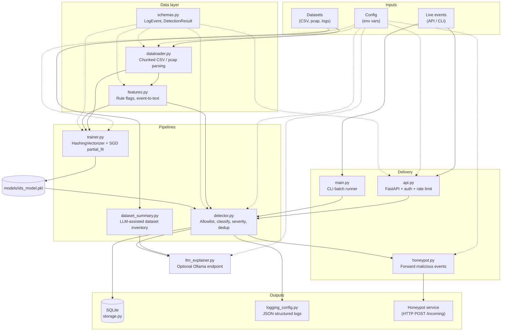

# Trainable IDS — Architecture

This document is the single-page mental model for the whole project. The
Mermaid diagram below renders natively on GitHub and most Markdown viewers.
For the same diagram in SVG form, see the LLM-generated version produced by
`python -m app.summarize_datasets` (it embeds an architecture overview into
the catalog report).

## High-level flow

## Module responsibilities

| Module | Responsibility |
| --- | --- |
| `config.py` | All runtime knobs, driven by environment variables. |
| `schemas.py` | `LogEvent` (input) and `DetectionResult` (output) dataclasses. |
| `dataloader.py` | Walk a data dir, stream chunks from CSV / paired CSV, parse pcap and text logs, normalize labels. |
| `features.py` | Regex-based rule flags plus the flat `key=value` text representation used by both training and inference. |
| `trainer.py` | Incremental training with `HashingVectorizer` + `SGDClassifier.partial_fit`. Writes `models/ids_model.pkl`. |
| `detector.py` | Runtime classifier. Handles allowlist, ML prediction, severity mapping, deduplication. |
| `llm_explainer.py` | Optional per-event explanation via an Ollama-compatible HTTP endpoint. Falls back to a deterministic string if `IDS_USE_LLM=false`. |
| `dataset_summary.py` | **New.** Scans the whole data directory and asks the LLM to describe every dataset it finds. Emits Markdown + JSON. |
| `summarize_datasets.py` | **New.** CLI wrapper for `dataset_summary`. |
| `honeypot.py` | Fire-and-forget forwarder for malicious events. |
| `storage.py` | SQLite persistence with indexed alerts, pagination, and aggregate stats. |
| `logging_config.py` | Structured (JSON) or human logging, configurable via env vars. |
| `api.py` | FastAPI front door: `/events`, `/alerts`, `/stats`, `/health`. Auth via `X-API-Key`, in-process rate limiting. |
| `main.py` | CLI entry point for batch detection on pcap / log files. |
| `train.py` | Thin wrapper that invokes `trainer.train_model()`. |

## End-to-end event lifecycle

1. An event arrives (API payload, pcap packet, or log line).
2. `dataloader` / `api.py` builds a `LogEvent`.
3. `detector.predict_event`:
   - runs `features.extract_rule_flags`
   - checks allowlist; if hit, emits `benign` with confidence 0.99
   - otherwise vectorizes and classifies
   - maps `(label, confidence, flags)` to a severity
   - asks `llm_explainer` for a rationale
   - checks the dedup cache
4. `honeypot.maybe_forward_to_honeypot` ships malicious events to the sink.
5. Non-benign, non-dedup results are written to SQLite by `storage.store_alert`.
6. The API or CLI returns/logs the `DetectionResult`.
